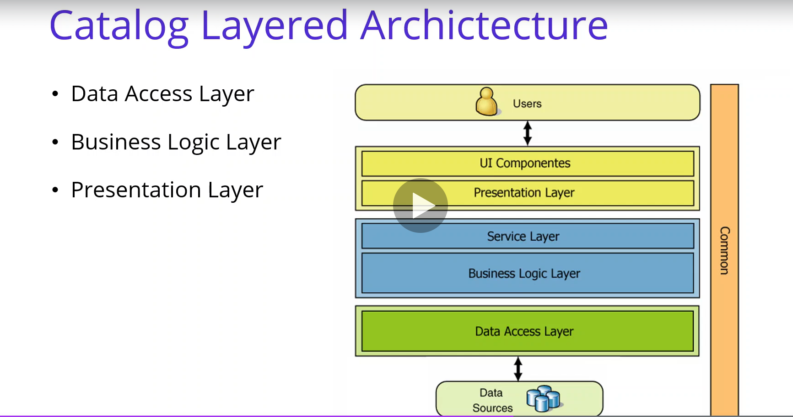
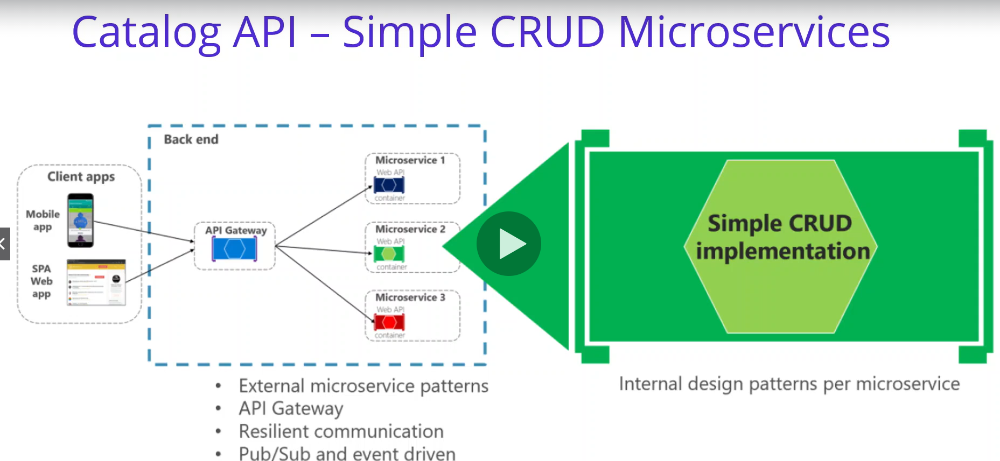
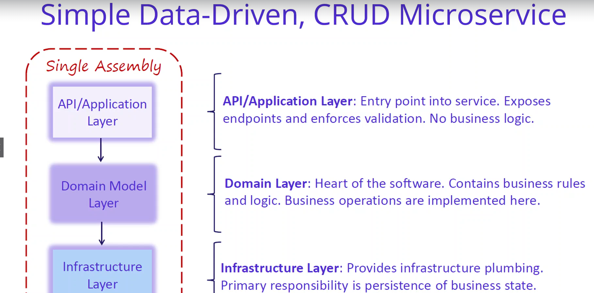
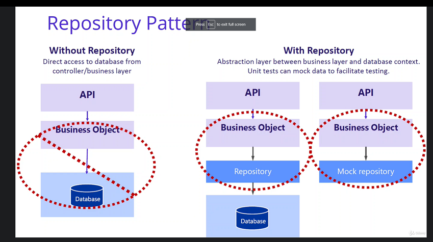

# Setup Project
- Create folder is name of sln  -> open cmd: dotnet new sln
- Open sln with visual studio. 
- Create project Catalog.Api with path add root fold/ services/catalog. No check https
- Setup debug: Profile: Catalog.Api and launch: project

# Setup DataBase MongoDb 
  1. Open docker desktop
  2. Search [DockerHub](https://hub.docker.com/_/mongo)
  3. Open in terminal in SlN run : docker pull mongo
  4. setup mongo docker -p(post of mongo) -d(Detached mode: Run container in the background, print new container id)
     - docker run -d -p 27107:27017 --name shopping-mongo mongo
     - if you want check log. you run command: docker log -f shopping-mongo
     - if you want run exec interactive with mongo created and  I would like to locate the mmean folder in order to create the best scripts inside of these: 
       - docker exec -it shopping-mongo /bin/bash
     - later create database: use CatalogDb -> create collection: db.createCollection('Products')
       - Query: db.Product.find({}).pretty()
       - Insert: db.Product.insertMany(objectjson)
       - Delete. db.Product.remove({}): delete all
# Analysis and Architecting of Catalog Microservices

### Simple Data-Driven

### Repository pattern
